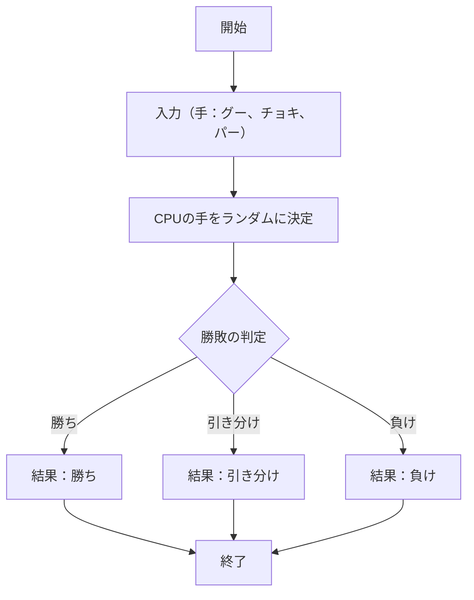
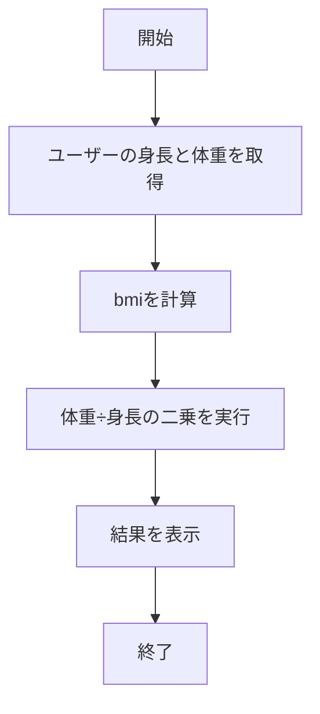
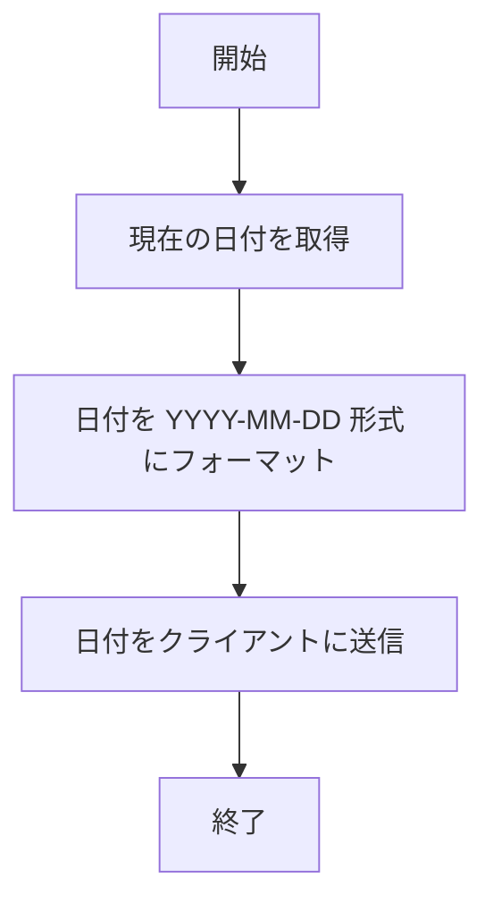

# webpro_06

## プログラムドキュメント

## ファイル一覧

| ファイル名         | 説明                 |
| ------------------ | -------------------- |
| app5.js            | プログラム本体       |
|views/janken.ejs| じゃんけん開始画面|
| views/bmi.ejs　　　 | bmi算出開始画面|
| views/weekday.ejs | 曜日算出開始画面|
| public/janken.html | じゃんけんの結果表示用HTMLファイル　|

## 起動方法
・ターミナルから node app5js を実行して、サーバー8080を立ち上げる

・ブラウザで以下のURLを検索する

じゃんけん：http://localhost:8080/janken

　　プレイヤーの手とCPUの手から勝敗を算出し public/janken.html に反映する

bmi：http://localhost:8080/bmi

　　入力された身長と体重からbmiを計算する
  
曜日表示：http://localhost:8080/weekday

　　入力された日付から曜日を計算し表示する

app5.js
じゃんけんの勝ち負け判定

bmi を計算

曜日の表示

